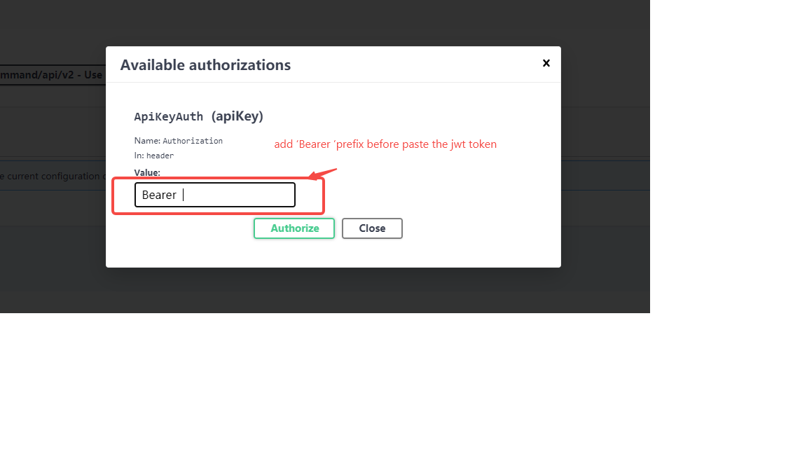

# Swagger UI For Edgex


将swaggerUI和edgex的open api 整合到一起，提供本地测试功能，大多数情况下edgex的 提供的 `ui` 模块满足基本的使用需求.

虽然edgex 在swagger hub提供了在线的swagger 工具，可是不能满足本地测试的需求. 

## edgex的swagger hub

将 name替换成edgex对应的模块即可访问
> https://app.swaggerhub.com/apis-docs/EdgeXFoundry1/{name}/2.0.0

以模块 `core-metadata` 为例：

> https://app.swaggerhub.com/apis-docs/EdgeXFoundry1/core-metadata/2.0.0#

## edgex的Open Api 定义

可以在模块对应的源码位置找到如：
core modules
> https://github.com/edgexfoundry/edgex-go/tree/main/openapi/v2

device services
> https://github.com/edgexfoundry/device-sdk-go/tree/main/openapi/v2

## 使用方式

本模块基于edgex的 `go-mod-bootstrap` 开发

所以配置方式与edgex 一致, 默认配置文件  [configuration.toml](./cmd/res/configuration.toml)

也可以使用 命令行参数`--confdir` 来配置。 但是 `-c` 选项好像不能用 

配置文件中所有变量均可以用环境变量覆盖，与edgex的配置方式一致


### service 
唯一需要修改的可能是 `Port`属性,改成一个本地端口补充冲突值  
```
[Service]
HealthCheckInterval = '10s'
Host = 'localhost'
Port = 8080
ServerBindAddr = ''  #blank value defaults to Service.Host value
StartupMsg = 'device rest started'
#MaxRequestSize limit the request body size in byte of put command
MaxRequestSize = 0 #value 0 unlimit the request size.
RequestTimeout = '5s'
```

## swagger 配置项目

项目启动后访问地址

> `{serice.host}:{service.port}/{swagger.PathPrefix}`

按照默认配置应该就是 ：

> http://localhost:8080/edgex-swagger-ui

关于swagger ui 可以参考官方文档[swagger-ui](https://swagger.io/tools/swagger-ui/)

```toml
[Swagger]
SwaggerPathPrefix="/edgex-swagger-ui/" # swagger ui 的请求路径
SwaggerFileDir="swagger-ui" # swagger的静态文件
CoreDir="openapi/core/v2" # edgex核心模块的open api位置。
DeviceSdkDir="openapi/device-sdk/v2" # device service 的open api位置
ReverseProxy = true #  是否开启反向代理,不开启的话会 将swagger的 所有try it 的请求发送到kong 网关
ProxyPrefix= "proxy" # 反向代理的请求路径
```

## kong 


```toml
[KongURL]
Server = "127.0.0.1"
AdminPort = 8001
AdminPortSSL = 8444
ApplicationPort = 8000
ApplicationPortSSL = 8443
StatusPort = 8001

```

## swagger components
如果 ` Swagger.ReverseProxy` 设置为false那么所有模块的请求会转发到kong网关,要求edgex的服务需要注册在kong网关中
如果为true 那么请求由反向代理服务来处理 `{serice.host}:{service.port}/{swagger.ProxyPrefix}/{Swaggercomponets.Route}`
主要是为了解决`cros`问题

```toml
[[Swagger.CoreComponents]]
Scheme="" # http default
Enable=true # not use it now
Route="core-command" # routeName in kong or local reversproxy
ApiVer="/api/v2" # will be add to the swagger server url to 
Name="core-command" # identifier of the open api,same to the open api modul
FileName="core-command.yaml" # the open api define from edgex source code 
Port="59882" # the component runtime server Port 
Host="core-command"  # the component runtime server host 
```


## 启动
main 函数
>  [main.go](./cmd/main.go)

构建
> go build -o edgex-swagger-ui main.go

启动

> ./edgex-swagger-ui


如果从源码启动, 如在`idea`里面调试可参考配置：
```toml
[Swagger]
SwaggerPathPrefix="/edgex-swagger-ui/" # swagger ui 的请求路径
SwaggerFileDir="cmd/res/swagger-ui" # swagger的静态文件
CoreDir="cmd/res/openapi/core/v2" # edgex核心模块的open api位置。
DeviceSdkDir="cmd/res/openapi/device-sdk/v2" # device service 的open api位置
ReverseProxy = true #  是否开启反向代理,不开启的话会 将swagger的 所有try it 的请求发送到kong 网关
ProxyPrefix= "proxy" # 反向代理的请求路径
```
同时设置启动命令行参数
> --confdir="cmd/res/"


## 示例


填了了kong网关的认证支持


需要注意的是如果不适用反向代理模式， 需要配置kong网关支持cros [kong cros plugin](https://docs.konghq.com/hub/kong-inc/cors/)


