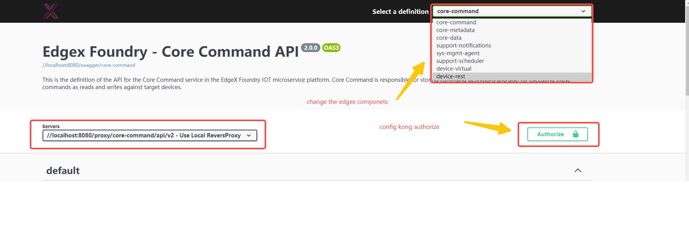
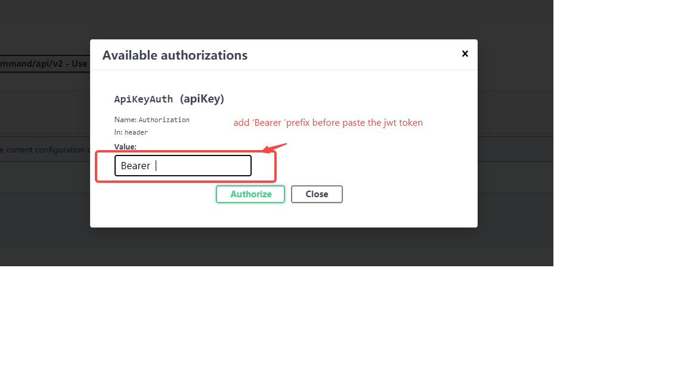

# Swagger UI For Edgex

Use swagger ui to render the edgex open API definitions ,for developer to test the edgex apis in development or local edgex runtime environments


the edgex ui is enough for most use case of edgex. This  module is  For learning  edgex or development. 

## online open api
the online edgex apis can refer to ,replace the `name` variable to the edgex component name.

> https://app.swaggerhub.com/apis-docs/EdgeXFoundry1/{name}/2.0.0

for edgex `core-metadata` module eg：

> https://app.swaggerhub.com/apis-docs/EdgeXFoundry1/core-metadata/2.0.0#

## edgex open api definitions
Defined in edgex source.

core modules
> https://github.com/edgexfoundry/edgex-go/tree/main/openapi/v2

device services
> https://github.com/edgexfoundry/device-sdk-go/tree/main/openapi/v2

## usage
use the `go-mod-bootstrap` module in the program main entry as most  edgex modules.

so the configuration file is  [configuration.toml](./cmd/res/configuration.toml)

And can also use `--confdir` but `-c` not available, also all the config can be 

override by the ENV  value.


### service 
value may be need to change is  `Port`  
```
[Service]
HealthCheckInterval = '10s'
Host = 'localhost'
Port = 8080
ServerBindAddr = ''  #blank value defaults to Service.Host value
StartupMsg = 'device rest started'
#MaxRequestSize limit the request body size in byte of put command
MaxRequestSize = 0 #value 0 unlimit the request size.
RequestTimeout = '5s'
```

## swagger config 
swagger component config
the entry path of swagger ui will be
`{serice.host}:{service.port}/{swagger.PathPrefix}`

for the default is ：

> http://localhost:8080/edgex-swagger-ui

the swagger ui refer to [swagger-ui](https://swagger.io/tools/swagger-ui/)

```toml
[Swagger]
SwaggerPathPrefix="/edgex-swagger-ui/" # the request path of the local swagger url  
SwaggerFileDir="swagger-ui" # the swagger files html javascript css imgs
CoreDir="openapi/core/v2" # the open api yaml of edegex core 
DeviceSdkDir="openapi/device-sdk/v2" # the open api yaml of edegex deviceservice
ReverseProxy = true # flag of use http reverse proxy. when true will start a reversporxy for all the swagger componets 
ProxyPrefix= "proxy" # reverse proxy path prefix 
```

## kong 

gateway config 

```toml
[KongURL]
Server = "127.0.0.1"
AdminPort = 8001
AdminPortSSL = 8444
ApplicationPort = 8000
ApplicationPortSSL = 8443
StatusPort = 8001

```

## swagger components
if ` Swagger.ReverseProxy` was set to false then will use the kong
as the swagger server url attr.

other ways swagger server will be `{serice.host}:{service.port}/{swagger.ProxyPrefix}/{Swaggercomponets.Route}`


```toml
[[Swagger.CoreComponents]]
Scheme="" # http default
Enable=true # not use it now
Route="core-command" # routeName in kong or local reversproxy
ApiVer="/api/v2" # will be add to the swagger server url to 
Name="core-command" # identifier of the open api,same to the open api modul
FileName="core-command.yaml" # the open api define from edgex source code 
Port="59882" # the component runtime server Port 
Host="core-command"  # the component runtime server host 
```
## start
the main func
>  [main.go](./cmd/main.go)

start

> go build -o edgex-swagger-ui main.go
>
> ./edgex-swagger-ui


if start from source code, eg debug in `idea`. Modify config 
```toml
[Swagger]
SwaggerPathPrefix="/edgex-swagger-ui/" # swagger ui 的请求路径
SwaggerFileDir="cmd/res/swagger-ui" # swagger的静态文件
CoreDir="cmd/res/openapi/core/v2" # edgex核心模块的open api位置。
DeviceSdkDir="cmd/res/openapi/device-sdk/v2" # device service 的open api位置
ReverseProxy = true #  是否开启反向代理,不开启的话会 将swagger的 所有try it 的请求发送到kong 网关
ProxyPrefix= "proxy" # 反向代理的请求路径
```
add variables in cmd line
> --confdir="cmd/res/"


## demo


support kong jwt token
Note when use kong as the swagger api's server,need a plugin to support  the cros  eg [kong cros plugin](https://docs.konghq.com/hub/kong-inc/cors/)


